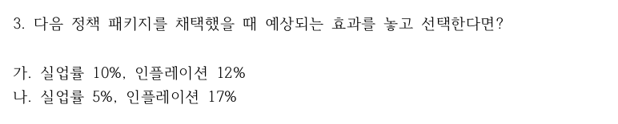
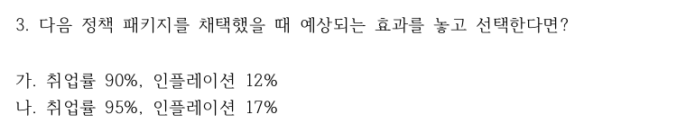
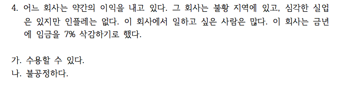
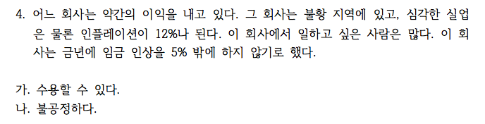

```{r setup, include=FALSE}
knitr::opts_chunk$set(echo = TRUE)
# install.packages("pander", repos = "https://cran.rstudio.com")
# install.packages("xlsx", repos = "https://cran.rstudio.com")
library(xlsx)
library(pander)
library(knitr)
panderOptions('table.split.table', Inf)
panderOptions('table.alignment.rownames', 'left')
panderOptions('table.alignment.default', 'right')
options(width = 180)
```

```{r, data, echo = TRUE, results = 'markup'}
quiz1115 <- read.xlsx("../data/quiz171115.xlsx", 
                      sheetIndex = 1, 
                      startRow = 2, 
                      endRow = 182, 
                      colIndex = c(3:7, 9:14), 
                      colClasses = rep("character", 12), 
                      stringsAsFactors = FALSE)
str(quiz1115)
names(quiz1115) <- c("dept", "id", "name", "year", "e.mail", "cell.no", "group", "Q1", "Q2", "Q3", "Q4")
quiz1115$dept <- factor(quiz1115$dept)
quiz1115$year <- factor(quiz1115$year)
quiz1115$group <- factor(quiz1115$group, levels = c("Red", "Black"))

birth_month.date <- strsplit(quiz1115$Q1, ",")
birth_month <- mapply(function(x) x[1], birth_month.date)
birth_month.f <- factor(birth_month, 
                        levels = c(1:12), 
                        labels = c(month.name))
# birth_month <- mapply(function(x) `[`(x, 1), birth_month.date)
table(birth_month.f)
birthdate <- ifelse(is.na(birth_month.date), 
                    NA, 
                    mapply(function(x) paste(x[1], "월", x[2], "일", sep = ""), 
                           birth_month.date))
quiz1115$Q1.2 <- birthdate
birthdate.2 <- birthdate[!is.na(birthdate)]
dup.b <- duplicated(birthdate.2)
birthdate.2[dup.b]
(b.dup.b <- birthdate.2[birthdate.2 %in% unique(birthdate.2[dup.b])])
index.dup.b <- which(birthdate %in% unique(b.dup.b))
quiz1115[index.dup.b, c("id", "Q1.2")]
kable(t(as.matrix(table(quiz1115$Q1.2[index.dup.b]))))

matching <- strsplit(quiz1115$Q2, "")
matching
ans <- strsplit("RCGL", split = "")
matching.count <- mapply(function(x) ifelse(x == unlist(ans), 1, 0), matching)
matching.score <- apply(matching.count, 2, sum)
quiz1115$Q2.2 <- matching.score
Black <- quiz1115$group == "Black"
Red <- quiz1115$group == "Red"
# quiz1115$Q4.2[quiz1115$group == "Black" & quiz1115$Q4 == "가"] <- "400명은 죽는다"
# quiz1115$Q4.2[quiz1115$group == "Black" & quiz1115$Q4 == "나"] <- "모두 사망 않을 확률 1/3"
# quiz1115$Q4.2[quiz1115$group == "Red" & quiz1115$Q4 == "가"] <- "200명은 살린다"
# quiz1115$Q4.2[quiz1115$group == "Red" & quiz1115$Q4 == "나"] <- "모두 살릴 확률 1/3"
# quiz1115$Q4.2 <- quiz1115$Q4
quiz1115$Q3.2[Red] <- ifelse(quiz1115$Q3[Red] == "가", "실업률10%(취업률90%), 인플레12%", ifelse(quiz1115$Q3[Red] == "나", "실업률5%(취업률95%), 인플레17%", NA))
quiz1115$Q3.2[Black] <- ifelse(quiz1115$Q3[Black] == "가", "실업률10%(취업률90%), 인플레12%", ifelse(quiz1115$Q3[Black] == "나", "실업률5%(취업률95%), 인플레17%", NA))
quiz1115$Q3.2 <- factor(quiz1115$Q3.2, levels = c("실업률10%(취업률90%), 인플레12%", "실업률5%(취업률95%), 인플레17%"))
quiz1115$Q4.2[Red] <- ifelse(quiz1115$Q4[Red] == "가", "수용가능", ifelse(quiz1115$Q4[Red] == "나", "불공정", NA))
quiz1115$Q4.2[Black] <- ifelse(quiz1115$Q4[Black] == "가", "수용가능", ifelse(quiz1115$Q4[Black] == "나", "불공정", NA))
quiz1115$Q4.2 <- factor(quiz1115$Q4.2, levels = c("수용가능", "불공정"))
# str(quiz1115)
pander(quiz1115[c("Q3", "Q3.2", "Q4", "Q4.2", "group")])
```

```{r, randomization, echo = FALSE, results = 'hide'}
summary(quiz1115)
```

### 퀴즈 응답

#### Birthday Problem

##### 생일이 같은 사람은 몇 명?

```{r, birthday problem, echo = FALSE}
dup.b.df <- quiz1115[index.dup.b, c("id", "Q1.2", "group")]
names(dup.b.df) <- c("학번", "생일", "그룹")
# pander(dup.b.df)
tbl.q1.a <- addmargins(table(quiz1115$Q1.2[index.dup.b]))
names(tbl.q1.a)[26] <- "계"
# tbl.q1.a
kable(t(as.matrix(tbl.q1.a)))
```

##### 이론적으로 기대인원은?

$N$을 전체 인원이라 할 때, 기대 인원은 $N\times\{1- (\frac{364}{365})^{N-1}\}$로 계산된다.
무응답이거나 결석한 학생을 제외한 응답 인원 158명에 대하여 기대인원을 계산하면

```{r, echo = TRUE}
options(digits = 3)
158 * (1 - (364 / 365) ^ 157)
```

##### 태어난 달의 분포는?

```{r, month of the birthdates, echo = FALSE}
birth_month.tbl <- table(quiz1115$group, "태어난 달" = birth_month.f)
birth_month.tbl.a <- addmargins(birth_month.tbl)
rownames(birth_month.tbl.a)[3] <- "계"
colnames(birth_month.tbl.a)[13] <- "계"
pander(birth_month.tbl.a)
```

#### Matching Problem


##### 정답갯수의 분포

```{r, matching, echo = FALSE}
matching.score.tbl <- table(quiz1115$group, "맞춘 갯수" = matching.score)
matching.score.tbl.a <- addmargins(matching.score.tbl)
rownames(matching.score.tbl.a)[3] <- "계"
colnames(matching.score.tbl.a)[5] <- "계"
pander(matching.score.tbl.a)
```

##### 카이제곱 적합도 테스트

랜덤하게 골랐다면, 각각의 확률은 9/24, 8/24, 6/24, 1/24임. 응답인원 150명을 각 확률에 곱해보면,

```{r, echo = FALSE}
prob <- c(9, 8, 6, 1) / 24
Expected <- 150 * prob
names(Expected) <- c("0", "1", "2", "4")
pander(t(as.matrix(round(Expected))))
```

```{r, chisquare goodness of fit test, echo = FALSE}
pander(chisq.test(table(matching.score), p = c(9, 8, 6, 1)/24, simulate.p.value = TRUE, B = 2000))
```

#### Framing Effects

##### 인플레이션과 일자리 정책 패키지





실업률이 10%인 것과 취업률이 90%인 것이 동등함에도 불구하고, 실업률과 인플레가 나오면 실업률이 낮아지는 정책을 선호하고 취업률과 인플레가 나오면 인플레가 낮아지는 정책을 선호함에 유의.

```{r, Framing Effect, echo = FALSE}
tbl.q3 <- table(quiz1115$group, quiz1115$Q3.2, exclude = NULL)
rownames(tbl.q3) <- c("Red(실업률 관점)", "Black(취업률 관점)")
kable(tbl.q3[1:2, ], caption = "Framing Effect")
```

##### % 비교.  

```{r, Framing effects in percentage, echo = FALSE}
tbl.q3.p.a <- addmargins(round(prop.table(tbl.q3[1:2, -3], margin = 1)*100, digits = 1))[1:2, ]
colnames(tbl.q3.p.a)[3] <- "계"
kable(tbl.q3.p.a)
```

#### 화폐 착각

##### 인플레이션과 임금인상





인플레 없이 7%를 삭감하는 것과 12% 인플레 상황에서 5%임금 인상은 동등한 조건인데도 '임금인상'이라는 말에 '수용가능하다'는 응답 비율이 늘어남에 유의.

```{r, Money illusion, echo = FALSE}
tbl.q4 <- table(quiz1115$group, quiz1115$Q4.2, exclude = NULL)
rownames(tbl.q4) <- c("Red(인플레0%, 임금삭감7%)", "Black(인플레12%, 임금인상5%)")
kable(tbl.q4[1:2, ], caption = "화폐 착각")
```

##### % 비교.  

```{r, Money illusion in percentage, echo = FALSE}
tbl.q4.p.a <- addmargins(round(prop.table(tbl.q4[1:2, -3], margin = 1)*100, digits = 1))[1:2, ]
colnames(tbl.q4.p.a)[3] <- "계"
kable(tbl.q4.p.a)
```

```{r, save, echo = FALSE}
#save.image("../R/quiz1115.rda")
```