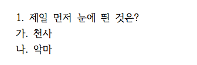
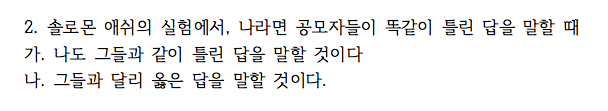
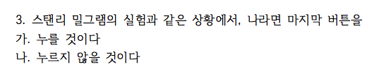
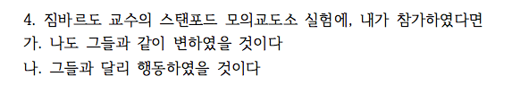

```{r setup, include=FALSE}
knitr::opts_chunk$set(echo = TRUE)
# install.packages("pander", repos = "https://cran.rstudio.com")
# install.packages("xlsx", repos = "https://cran.rstudio.com")
# library(xlsx)
library(openxlsx)
library(magrittr)
library(pander)
library(knitr)
panderOptions('table.split.table', Inf)
panderOptions('table.alignment.rownames', 'left')
panderOptions('table.alignment.default', 'right')
options(width = 180)
```

```{r, data, echo = FALSE, results = 'hide'}
quiz0516 <- "../data/quiz180516_hn.xlsx" %>% 
  read.xlsx(startRow = 2, rows = 2:182, cols = c(3:7, 9:14))
# quiz0516 <- read.xlsx("../data/quiz0516_hn.xlsx", 1, startRow = 2, endRow = 161, colIndex = c(3:7, 9:14), colClasses = c(rep("character", 11)), stringsAsFactors = FALSE)
str(quiz0516)
names(quiz0516) <- c("dept", "id", "name", "year", "e.mail", "cell.no", "Q1", "Q2", "Q3", "Q4", "group")
quiz0516$dept %<>% factor
quiz0516$year %<>% factor
quiz0516$group %<>% factor(levels = c("Red", "Black"))
Red <- quiz0516$group == "Red"
Black <- quiz0516$group == "Black"
quiz0516$Q1.2[Red] <- ifelse(quiz0516$Q1[Red] == "가", "천사", ifelse(quiz0516$Q1[Red] == "나", "악마", NA))
quiz0516$Q1.2[Black] <- ifelse(quiz0516$Q1[Black] == "가", "악마", ifelse(quiz0516$Q4[Black] == "나", "천사", NA))
quiz0516$Q1.2 <- factor(quiz0516$Q1.2, levels = c("천사", "악마"))
quiz0516$Q2.2[Red] <- ifelse(quiz0516$Q2[Red] == "가", "동조", ifelse(quiz0516$Q2[Red] == "나", "거부", "무응답"))
quiz0516$Q2.2[Black] <- ifelse(quiz0516$Q2[Black] == "가", "거부", ifelse(quiz0516$Q2[Black] == "나", "동조", "무응답"))
quiz0516$Q2.2 <- factor(quiz0516$Q2.2, 
                        levels = c("동조", "거부", "무응답"),
                        labels = c("동조", "거부", "불참"))

quiz0516$Q3.2[Red] <- ifelse(quiz0516$Q3[Red] == "가", "누를 것이다", ifelse(quiz0516$Q3[Red] == "나", "누르지 않을 것이다", "무응답"))
quiz0516$Q3.2[Black] <- ifelse(quiz0516$Q3[Black] == "가", "누르지 않을 것이다", ifelse(quiz0516$Q3[Black] == "나", "누를 것이다", "무응답"))
quiz0516$Q3.2 <- factor(quiz0516$Q3.2, 
                        levels = c("누를 것이다", "누르지 않을 것이다", "무응답"),
                        labels = c("누를 것이다", "누르지 않을 것이다", "불참"))

quiz0516$Q4.2[Red] <- ifelse(quiz0516$Q4[Red] == "가", "그들과 같이", ifelse(quiz0516$Q4[Red] == "나", "그들과 달리", "무응답"))
quiz0516$Q4.2[Black] <- ifelse(quiz0516$Q4[Black] == "가", "그들과 달리", ifelse(quiz0516$Q4[Black] == "나", "그들과 같이", "무응답"))
quiz0516$Q4.2 <- factor(quiz0516$Q4.2, 
                        levels = c("그들과 같이", "그들과 달리", "무응답"), 
                        labels = c("그들과 같이", "그들과 달리", "불참"))
str(quiz0516)
```

```{r, randomization, echo = FALSE, results = 'hide'}
pander(summary(quiz0516))
```

### 퀴즈 응답 비교

#### Circle Limit IV



##### 천사와 악마

```{r, bystander, echo = FALSE}
tbl_q1_a <- quiz0516$Q1.2 %>% 
  table(quiz0516$group, ., useNA = "ifany") %>%
  addmargins
colnames(tbl_q1_a)[3:4] %<>% `<-`(., c("결석", "계"))
rownames(tbl_q1_a)[3] %<>% `<-`(., "계")
tbl_q1_a %>% pander 
tbl_q1_a[-3, -4] %>% 
  chisq.test(simulate.p.value = TRUE) %>% 
  pander
```

##### 천사와 악마(%)

```{r, bystander in percentage, echo = FALSE}
tbl_q1_a %>% 
  `[`(3, -(3:4)) %>%
  prop.table %>% 
  c(., "계" = sum(.)) %>%
  `*`(100) %>%
  format(digits = 2, nsmall = 1) %>%
  pander
```

#### Solomon Asch



##### 집단 사고

```{r, obedience, echo = FALSE}
tbl_q2_a <- quiz0516$Q2.2 %>% 
  table(quiz0516$group, ., useNA = "ifany") %>%
  addmargins
colnames(tbl_q2_a)[3:5] %<>% `<-`(., c("불참", "결석", "계"))
rownames(tbl_q2_a)[3] %<>% `<-`(., "계")
tbl_q2_a %>% pander 
tbl_q2_a[-3, -(3:5)] %>% 
  chisq.test(simulate.p.value = TRUE) %>% 
  pander
```

##### 집단 사고 (%)

```{r, obedience in percentage, echo = FALSE}
tbl_q2_a %>% 
  `[`(3, -(3:5)) %>%
  prop.table %>% 
  c(., "계" = sum(.)) %>%
  `*`(100) %>%
  format(digits = 2, nsmall = 1) %>%
  pander
```

#### Stanley Milgram



##### 복종

```{r, Power of 3, echo = FALSE}
tbl_q3_a <- quiz0516$Q3.2 %>% 
  table(quiz0516$group, ., useNA = "ifany") %>%
  addmargins
colnames(tbl_q3_a)[3:5] %<>% `<-`(., c("불참", "결석", "계"))
rownames(tbl_q3_a)[3] %<>% `<-`(., "계")
tbl_q3_a %>% pander 
tbl_q3_a[-3, -(3:5)] %>% 
  chisq.test(simulate.p.value = TRUE) %>% 
  pander
```

##### 복종 (%)

```{r, Power of 3 in percentage, echo = FALSE}
tbl_q3_a %>% 
  `[`(3, -(3:5)) %>%
  prop.table %>% 
  c(., "계" = sum(.)) %>%
  `*`(100) %>%
  format(digits = 2, nsmall = 1) %>%
  pander
```

#### Philip Zimbardo

#### 스탠포드 모의교도소 실험



```{r, Framing Effect, echo = FALSE}
tbl_q4_a <- quiz0516$Q4.2 %>% 
  table(quiz0516$group, ., useNA = "ifany") %>%
  addmargins
colnames(tbl_q4_a)[3:5] %<>% `<-`(., c("불참", "결석", "계"))
rownames(tbl_q4_a)[3] %<>% `<-`(., "계")
tbl_q4_a %>% pander 
tbl_q4_a[-3, -(3:5)] %>% 
  chisq.test(simulate.p.value = TRUE) %>% 
  pander
```

##### 스탠포드 모의교도소 실험(%).  

```{r, Framing effects in percentage, echo = FALSE}
tbl_q4_a %>% 
  `[`(3, -(3:5)) %>%
  prop.table %>% 
  c(., "계" = sum(.)) %>%
  `*`(100) %>%
  format(digits = 2, nsmall = 1) %>%
  pander
```

```{r, save, echo = FALSE}
#save.image("../R/quiz0516.RData")
```