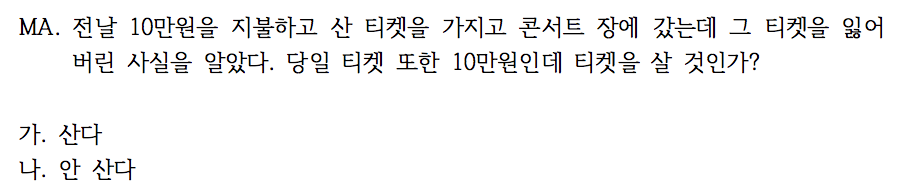
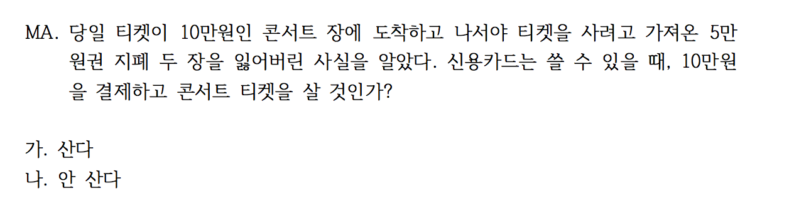

```{r, include = FALSE}
knitr::opts_chunk$set(echo = TRUE)
# install.packages("pander", repos = "https://cran.rstudio.com")
# install.packages("xlsx", repos = "https://cran.rstudio.com")
library(magrittr)
library(xlsx)
library(pander)
library(knitr)
panderOptions('table.split.table', Inf)
panderOptions('table.alignment.rownames', 'left')
panderOptions('table.alignment.default', 'right')
options(width=180)
```

```{r, echo = FALSE, results = 'hide'}
quiz1112_2 <- "../data/quiz181112_2.xlsx" %>% 
  read.xlsx(sheetIndex = 1, 
            startRow = 2, 
            endRow = 155, 
            colIndex = c(3:7, 9:14), 
            colClasses = c(rep("character", 11)), 
            stringsAsFactors = FALSE)
quiz1112_2 %>% 
  str
names(quiz1112_2) <- c("dept", "id", "name", "year", "e.mail", "cell.no", "Q1", "Q2", "Q3", "Q4", "group")
quiz1112_2$dept %<>% 
  factor
quiz1112_2$year %<>% 
  factor
quiz1112_2$group %<>% 
  factor(levels = c("Red", "Black"))
quiz1112_2$Q1 %<>% 
  factor(levels = c("가", "나", "다", "라"), 
         labels = c("높았던 시기에 높았다", 
                    "높이면 높아진다", 
                    "높았던 시기에 많았다", 
                    "높이면 많아진다"))
quiz1112_2$Q2 %<>% 
  factor(levels = c("가", "나", "다", "라"),
         labels = c("황금기 함께 상승", 
                    "신자유주의시기 함께 상승", 
                    "신자유주의시기 생산성 상승",
                    "신자유주의시기 임금 상승"))
quiz1112_2$Q3 %<>% 
  factor(levels = c("가", "나", "다", "라", "무응답"), 
         labels = c("임금 상승 미흡", 
                    "고임금 상승률 가속", 
                    "임금격차 심화", 
                    "중산층 임금 회복세",
                    "불참"))
quiz1112_2$Q4 %<>% 
  factor(levels = c("가", "나", "무응답" ),
         labels = c("산다", "안 산다", "불참"))
quiz1112_2 %>% str
```

```{r, echo = FALSE, results = 'hide'}
quiz1112_2 %>% 
  summary %>% 
  pander
```

## 퀴즈 응답 비교

### 최고한계세율과 소득증가율

`r knitr::include_graphics("../pics/Quiz171101_01.png", dpi = NA)`

#### 집계

```{r, echo = FALSE}
tbl_q1_a <- quiz1112_2$Q1 %>% 
  table(quiz1112_2$group, ., useNA = "ifany") %>%
  cbind("계" = rowSums(.)) %>%
  rbind("계" = colSums(.))
colnames(tbl_q1_a)[5] %<>% `<-`(., "결석")
tbl_q1_a %>% 
  pander 
tbl_q1_a[-3, -(5:6)] %>% 
  chisq.test(simulate.p.value = TRUE) %>% 
  pander
```

#### %

```{r, echo = FALSE}
tbl_q1_a %>% 
  `[`(3, -(5:6)) %>%
  prop.table %>% 
  c(., "계" = sum(.)) %>%
  `*`(100) %>%
  format(digits = 2, nsmall = 1) %>%
  pander
```

### 생산성과 임금

`r knitr::include_graphics("../pics/Quiz171101_02.png", dpi = NA)`

#### 집계

```{r, state arithmetic, echo = FALSE}
tbl_q2_a <- quiz1112_2$Q2 %>%
  table(quiz1112_2$group, ., useNA = "ifany") %>%
  cbind("계" = rowSums(.)) %>%
  rbind("계" = colSums(.))
colnames(tbl_q2_a)[5] <- "결석"
tbl_q2_a %>% 
  pander 
tbl_q2_a %>%
  `[`(-3, -(5:6)) %>% 
  chisq.test(simulate.p.value = TRUE) %>%
  pander
```

#### %

```{r, state arithmetic in percentage, echo = FALSE}
tbl_q2_a %>%
  `[`(3, -(5:6)) %>%
  prop.table %>%
  c(., "계" = sum(.)) %>%
  `*`(100) %>%
  format(., digits = 2, nsmall = 1) %>%
  pander
```

### 생산성과 평균 및 중위임금(1973 ~ 2014)

`r knitr::include_graphics("../pics/Quiz171101_03.png", dpi = NA)`

#### 집계

```{r, labour force, echo = FALSE}
tbl_q3_a <- quiz1112_2$Q3 %>%
  table(quiz1112_2$group, ., useNA = "ifany") %>%
  cbind("계" = rowSums(.)) %>%
  rbind("계" = colSums(.))
colnames(tbl_q3_a)[6] <- "결석"
tbl_q3_a %>% 
  pander
tbl_q3_a %>%
  `[`(-3, -(5:7)) %>% 
  chisq.test(simulate.p.value = TRUE) %>%
  pander
```

#### %

```{r, labour force in percentage, echo = FALSE}
tbl_q3_a %>%
  `[`(3, -(5:7)) %>%
  prop.table %>%
  c(., "계" = sum(.)) %>%
  `*`(100) %>%
  format(digits = 2, nsmall = 1) %>%
  pander
```

### 심적회계(Mental Account)

돈 주고 산 티켓을 잃어버리는 것과 티켓을 살 돈을 잃어버리고 카드로 살 수 있는 것의 심리적 차이에 대한 질문.





#### 티켓과 현금

10만원 짜리 입장권을 잃어버리는 것과 티켓 살 돈 10만원을 잃어버리는 것이 동일한 금액임에도 티켓을 잃어버렸을 경우보다 현금을 잃어 버렸을 경우에  사겠다는 비율이 높아지고 그 차이가 통계적으로 매우 유의하다.

#### 집계

```{r, Mental Account, echo = FALSE}
tbl_q4_a <- quiz1112_2$Q4 %>%
  table(quiz1112_2$group, ., useNA = "ifany") %>%
  cbind("계" = rowSums(.)) %>%
  rbind("계" = colSums(.))
colnames(tbl_q4_a) <- c("산다", "안 산다", "불참", "결석", "계")
rownames(tbl_q4_a) <- c("티켓 분실", "현금 분실", "계")
tbl_q4_a %>% 
  pander
tbl_q4_a %>%
  `[`(-3, -(3:5)) %>%
  chisq.test(simulate.p.value = FALSE) %>%
  pander
```

#### % 비교.  

```{r, Mental account  in percentage, echo = FALSE}
tbl_q4_a %>% 
  `[`(-3, -(3:5)) %>%
  prop.table(margin = 1) %>%
  `*`(100) %>%
  cbind("계" = rowSums(.)) %>%
  format(digits = 2, nsmall = 1) %>%
  pander
```

```{r, save, echo = FALSE}
save.image("../R/quiz1112_2.RData")
```