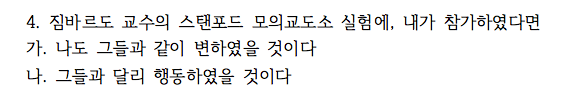

```{r setup, include=FALSE}
knitr::opts_chunk$set(echo = TRUE)
# install.packages("pander", repos = "https://cran.rstudio.com")
# install.packages("xlsx", repos = "https://cran.rstudio.com")
# library(xlsx)
library(xlsx)
library(magrittr)
library(pander)
library(knitr)
panderOptions('table.split.table', Inf)
panderOptions('table.alignment.rownames', 'left')
panderOptions('table.alignment.default', 'right')
options(width = 180)
```

```{r, data, echo = FALSE, results = 'hide'}
quiz1119 <- "../data/quiz181119_hn.xlsx" %>% 
  read.xlsx(sheetIndex = 1, 
            startRow = 2, endRow = 155, 
            colIndex = c(3:7, 9:14), colClasses = c(rep("character", 11)),
            stringsAsFactors = FALSE)
# quiz1119 <- read.xlsx("../data/quiz1119_hn.xlsx", 1, startRow = 2, endRow = 161, colIndex = c(3:7, 9:14), colClasses = c(rep("character", 11)), stringsAsFactors = FALSE)
str(quiz1119)
names(quiz1119) <- c("dept", "id", "name", "year", "e.mail", "cell.no", "Q1", "Q2", "Q3", "Q4", "group")
quiz1119$dept %<>% 
  factor
quiz1119$year %<>% 
  factor
quiz1119$group %<>% 
  factor(levels = c("Red", "Black"))
quiz1119$Q1 %<>% 
  factor(levels = c("가", "나"))
quiz1119$Q1_2 <- quiz1119$Q1
levels(quiz1119$Q1_2[quiz1119$group == "Black"]) <- c("나", "가") 
levels(quiz1119$Q1_2) <- c("천사", "악마")
quiz1119$Q2 %<>% 
  factor(levels = c("가", "나"))
quiz1119$Q2_2 <- quiz1119$Q2
levels(quiz1119$Q2_2[quiz1119$group == "Black"]) <- c("나", "가") 
levels(quiz1119$Q2_2) <- c("동조", "거부")
quiz1119$Q3 %<>% 
  factor(levels = c("가", "나", "무응답"))
quiz1119$Q3_2 <- quiz1119$Q3
levels(quiz1119$Q3_2[quiz1119$group == "Black"]) <- c("나", "가", "무응답") 
levels(quiz1119$Q3_2) <- c("누를 것이다", "누르지 않을 것이다", "불참")
quiz1119$Q4 %<>% 
  factor(levels = c("가", "나", "무응답"))
quiz1119$Q4_2 <- quiz1119$Q4
levels(quiz1119$Q4_2[quiz1119$group == "Black"]) <- c("나", "가", "무응답") 
levels(quiz1119$Q4_2) <- c("그들과 같이", "그들과 달리", "불참")
str(quiz1119)
```

```{r, randomization, echo = FALSE, results = 'hide'}
pander(summary(quiz1119))
```

## 퀴즈 응답 비교

### Circle Limit IV


#### 천사와 악마

```{r, bystander, echo = FALSE}
tbl_q1_a <- quiz1119$Q1_2 %>% 
  table(quiz1119$group, ., useNA = "ifany") %>%
  cbind("계" = rowSums(.)) %>%
  rbind("계" = colSums(.))
colnames(tbl_q1_a)[3] %<>% 
  `<-`(., "결석")
tbl_q1_a %>% 
  pander 
tbl_q1_a[-3, -4] %>% 
  chisq.test(simulate.p.value = TRUE) %>% 
  pander
```

#### 천사와 악마(%)

```{r, bystander in percentage, echo = FALSE}
tbl_q1_a %>% 
  `[`(3, -(3:4)) %>%
  prop.table %>% 
  c(., "계" = sum(.)) %>%
  `*`(100) %>%
  format(digits = 2, nsmall = 1) %>%
  pander
```

### Solomon Asch


#### 집단 사고

```{r, obedience, echo = FALSE}
tbl_q2_a <- quiz1119$Q2_2 %>% 
  table(quiz1119$group, ., useNA = "ifany") %>%
  cbind("계" = rowSums(.)) %>%
  rbind("계" = colSums(.))
colnames(tbl_q2_a)[3] %<>% 
  `<-`(., "결석")
tbl_q2_a %>% 
  pander 
tbl_q2_a[-3, -(3:4)] %>% 
  chisq.test(simulate.p.value = TRUE) %>% 
  pander
```

#### 집단 사고 (%)

```{r, obedience in percentage, echo = FALSE}
tbl_q2_a %>% 
  `[`(3, -(3:4)) %>%
  prop.table %>% 
  c(., "계" = sum(.)) %>%
  `*`(100) %>%
  format(digits = 2, nsmall = 1) %>%
  pander
```

### Stanley Milgram


#### 복종

```{r, Power of 3, echo = FALSE}
tbl_q3_a <- quiz1119$Q3_2 %>% 
  table(quiz1119$group, ., useNA = "ifany") %>%
  cbind("계" = rowSums(.)) %>%
  rbind("계" = colSums(.))
colnames(tbl_q3_a)[3:4] %<>% 
  `<-`(., c("불참", "결석"))
tbl_q3_a %>% 
  pander 
tbl_q3_a[-3, -(3:5)] %>% 
  chisq.test(simulate.p.value = TRUE) %>% 
  pander
```

#### 복종 (%)

```{r, Power of 3 in percentage, echo = FALSE}
tbl_q3_a %>% 
  `[`(3, -(3:5)) %>%
  prop.table %>% 
  c(., "계" = sum(.)) %>%
  `*`(100) %>%
  format(digits = 2, nsmall = 1) %>%
  pander
```

### Philip Zimbardo

#### 스탠포드 모의교도소 실험



```{r, Framing Effect, echo = FALSE}
tbl_q4_a <- quiz1119$Q4_2 %>% 
  table(quiz1119$group, ., useNA = "ifany") %>%
  cbind("계" = rowSums(.)) %>%
  rbind("계" = colSums(.))
colnames(tbl_q4_a)[4] %<>% 
  `<-`(., "결석")
tbl_q4_a %>% 
  pander 
tbl_q4_a[-3, -(3:5)] %>% 
  chisq.test(simulate.p.value = TRUE) %>% 
  pander
```

#### 스탠포드 모의교도소 실험(%).  

```{r, Framing effects in percentage, echo = FALSE}
tbl_q4_a %>% 
  `[`(3, -(3:5)) %>%
  prop.table %>% 
  c(., "계" = sum(.)) %>%
  `*`(100) %>%
  format(digits = 2, nsmall = 1) %>%
  pander
```

```{r, save, echo = FALSE}
#save.image("../R/quiz1119.RData")
```